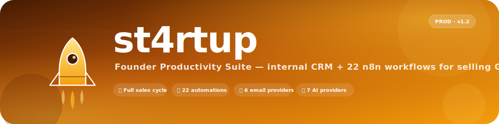
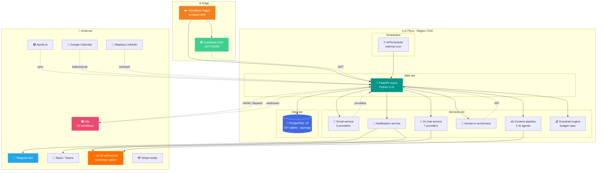
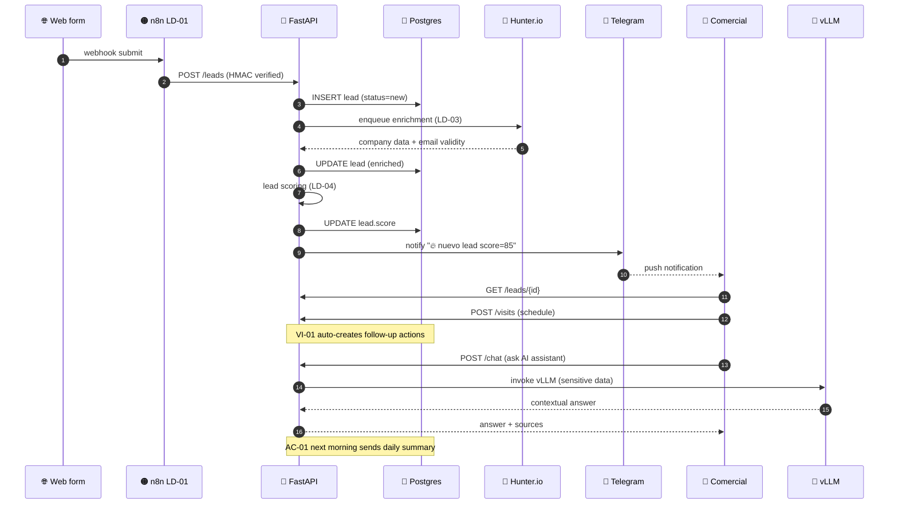
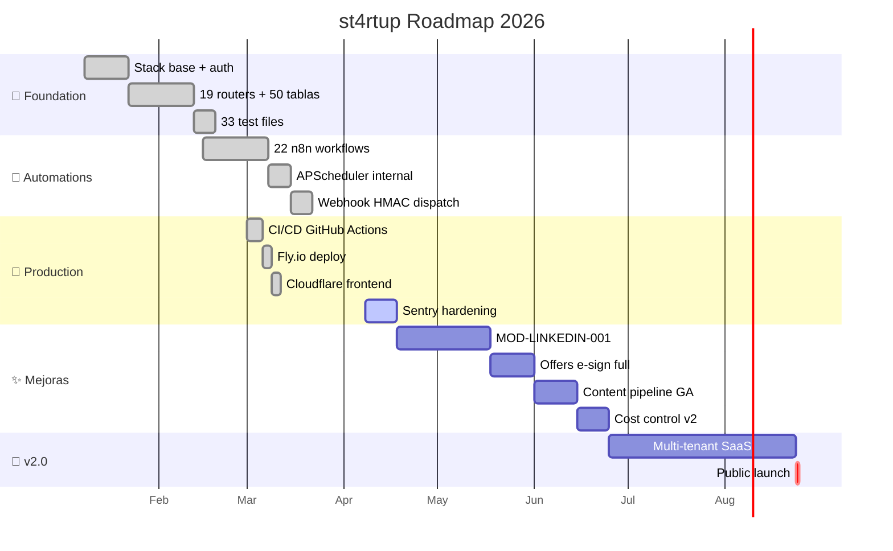

<div align="center">



<br/>

<a href="#"></a>
<a href="#"></a>
<a href="#"></a>
<a href="#"></a>
<a href="#"></a>
<a href="#"></a>

<br/>

**Internal Sales CRM · 22 n8n Automations · 7 AI providers · 🇪🇺 EU-hosted**
_Riskitera's commercial cockpit for selling GRC into ENS / NIS2 / DORA / ISO 27001 / EU AI Act accounts_

<br/>

[](https://www.python.org/)
[](https://fastapi.tiangolo.com/)
[](https://www.sqlalchemy.org/)
[](https://docs.pydantic.dev/)
[](https://www.postgresql.org/)
[](https://supabase.com/)
[](https://react.dev/)
[](https://vitejs.dev/)
[](https://tailwindcss.com/)
[](https://n8n.io/)
[](https://fly.io/)
[](https://pages.cloudflare.com/)
[](https://github.com/features/actions)
[](https://core.telegram.org/bots)

</div>

<br/>

<div align="center">

### 🚀 The cockpit a solo founder needs to <ins>run a full B2B GRC sales cycle without a sales team</ins>

</div>

<br/>

```diff
+ 📋 Full sales cycle: leads · visits · pipeline · opportunities · offers · monthly reviews · NPS/CSAT
+ 🔁 22 n8n automations baked in: welcome sequences, daily summaries, escalations, pipeline alerts
+ 📨 6 email providers (Resend · Zoho · Brevo · SES · Mailgun · SMTP) with open/click tracking
+ 🤖 7 AI providers behind a unified chat assistant (incl. self-hosted vLLM for sensitive data)
+ 🔔 Real-time alerts via Telegram, Slack/Teams webhooks and outbound HMAC-signed webhooks
+ 🇪🇺 100% EU-hosted (Fly.io CDG + Cloudflare Pages + Supabase EU)
- ❌ No vendor lock-in to a single email provider
- ❌ No US-only data residency
- ❌ No SaaS-CRM seat tax — you own the stack
```

<br/>

---

## 📖 Tabla de contenidos

<table>
<tr>
<td>

- [🎯 ¿Qué es st4rtup?](#-qué-es-st4rtup)
- [✨ Características](#-características)
- [🏗️ Arquitectura](#️-arquitectura)
- [🔄 Flujo de un lead](#-flujo-de-un-lead)
- [🧱 Stack tecnológico](#-stack-tecnológico)

</td>
<td>

- [📦 Estructura del proyecto](#-estructura-del-proyecto)
- [🔁 22 automatizaciones n8n](#-22-automatizaciones-n8n)
- [🧩 Módulos del CRM](#-módulos-del-crm)
- [🚀 Quick start](#-quick-start)
- [🗺️ Roadmap](#️-roadmap)

</td>
<td>

- [📚 Documentación](#-documentación)
- [🛡️ Seguridad y soberanía](#️-seguridad-y-soberanía)
- [⚖️ Comparativa](#️-comparativa-vs-competencia)
- [🤝 Contribuir](#-contribuir)
- [📬 Contacto](#-contacto)

</td>
</tr>
</table>

---

## 🎯 ¿Qué es st4rtup?

**st4rtup** (a.k.a. *Riskitera Sales*) es el CRM comercial interno construido por Riskitera S.L.U. para vender su plataforma GRC a empresas españolas y europeas sujetas a regulaciones de ciberseguridad (**ENS Alto · NIS2 · DORA · ISO 27001 · EU AI Act**).

A diferencia de los CRMs SaaS clásicos (HubSpot, Pipedrive, Salesforce), que cobran por seat, fuerzan workflows pre-cocinados y dependen de servidores en US, **st4rtup está diseñado como cockpit de founder**:

<table>
<tr>
<td width="50%" valign="top">

### 🚫 Modelo SaaS-CRM tradicional
- Pricing por seat — caro para founders con solo 1-3 comerciales
- Workflows rígidos: si no encajas, se rompen
- Datos en US (HubSpot, Salesforce, Pipedrive)
- Automatizaciones limitadas o de pago extra
- Vendor lock-in a un solo email provider
- Asistente IA opaco, sin opción self-hosted

</td>
<td width="50%" valign="top">

### ✅ Modelo st4rtup
- **Founder-first**: stack propio, cero seat tax
- **22 automations** incluidas, código abierto en n8n
- **EU-hosted**: Fly.io CDG + Cloudflare + Supabase EU
- **6 email providers** intercambiables (failover real)
- **7 AI providers** con vLLM self-hosted como opción soberana
- **Telegram + Slack + Teams + webhooks HMAC** out-of-the-box

</td>
</tr>
</table>

---

## ✨ Características

<div align="center">

| 📋 Sales Ops | 🔁 Automatización | 🤖 IA & Comms | 🛡️ Operaciones |
|:---:|:---:|:---:|:---:|
| Lead capture + scoring | 22 workflows n8n seed | 7 AI providers | RBAC: admin · comercial · viewer |
| Visitas + auto-follow-ups | APScheduler interno | Self-hosted vLLM option | Audit log inmutable |
| Pipeline drag-and-drop | Daily summaries | Content pipeline 4-agent | Cost control + guardrails |
| Ofertas + e-signature | Escalado de acciones | Social listening | Feature flags GrowthBook |
| NPS/CSAT públicos | Pipeline stage triggers | Hunter.io enrichment | Webhook HMAC dispatcher |
| Account plans + monthly reviews | Escheduler stale-deal | Waalaxy LinkedIn outreach | Telegram + Slack + Teams |

</div>

<br/>

<details>
<summary>📋 <b>Ver módulos de negocio cubiertos</b></summary>

<br/>

| # | Módulo | Casos de uso |
|---|---|---|
| 1 | **Leads** | Captura desde web/Apollo/CSV, scoring, enriquecimiento Hunter.io, dedup |
| 2 | **Visitas comerciales** | Calendario, resultado, auto-creación de acciones de follow-up |
| 3 | **Pipeline** | Etapas drag-and-drop, alertas de deal estancado, weekly report |
| 4 | **Oportunidades** | Forecasting, probabilidad, weighted ARR |
| 5 | **Ofertas** | PDF white-label, e-signature DocuSign/YouSign, invoicing |
| 6 | **Account plans** | Planificación estratégica por cliente clave |
| 7 | **Monthly reviews** | Status de proyecto + reporting consolidado |
| 8 | **Encuestas** | NPS post-cierre + CSAT trimestral con links públicos |
| 9 | **Email campaigns** | Multi-provider, open/click tracking, follow-ups secuenciados |
| 10 | **Notificaciones** | DB + Telegram + Slack + Teams + webhooks salientes HMAC |
| 11 | **Chat assistant** | Conversaciones context-aware con 7 AI backends |
| 12 | **Reports** | Pipeline health, actividad, rendimiento por comercial |
| 13 | **Content pipeline** | 4 AI agents: keyword → draft → SEO → meta tags |
| 14 | **Social listening** | Brand + competitor monitoring |
| 15 | **Cost control** | Budget caps + cost events + guardrail engine para llamadas LLM |

</details>

---

## 🏗️ Arquitectura



<br/>

## 🔄 Flujo de un lead



---

## 🧱 Stack tecnológico

<div align="center">

### 🐍 Backend


### 🎨 Frontend


### 🗄️ Datos


### 📨 Email & Notif


### 🤖 AI & Automation


### ☁️ Infra & CI/CD


</div>

---

## 📦 Estructura del proyecto

```
st4rtup/
├── 📄 CLAUDE.md                       # Reglas de desarrollo + contexto
├── 📄 ARCHITECTURE.md                 # Patrones del sistema y gaps
├── 📄 SECURITY_REVIEW.md              # OWASP Top 10 audit
├── 📄 CODE_REVIEW.md                  # Revisión de calidad
├── 📄 QA_PLAN.md                      # Estrategia de testing
├── 📄 README.md                       # ← estás aquí
│
├── 📁 backend/                        # FastAPI async
│   ├── 📁 app/
│   │   ├── 🌐 api/v1/endpoints/       # 19 routers (leads, visits, emails, ...)
│   │   ├── 🛠️ core/                   # config · database · security
│   │   ├── 🗂️ models/                 # SQLAlchemy 2 (por dominio)
│   │   ├── 📋 schemas/                # Pydantic v2 (por dominio)
│   │   ├── 🔧 services/               # Email · notif · AI · content · cost · vLLM
│   │   ├── 🤖 agents/                 # Agent definitions
│   │   ├── 📨 email_templates/        # Plantillas Jinja
│   │   ├── ⏰ tasks.py                # APScheduler jobs
│   │   └── 🛠️ utils/
│   ├── 📁 alembic/                    # Migraciones async
│   ├── 📁 tests/                      # 33 test files (pytest-asyncio)
│   ├── 🐳 Dockerfile
│   └── requirements.txt
│
├── 📁 frontend/                       # React 18 + Vite SPA
│   └── 📁 src/
│       ├── 📁 pages/                  # 48+ pages: Dashboard · Leads · Pipeline ·
│       │                              # Actions · GTM · Marketing · ContentPipeline ·
│       │                              # ReportBuilder · Webhooks · CostControl · ...
│       ├── 📁 components/             # Layout · widgets · common reusable
│       ├── 📁 services/               # Axios api client
│       ├── 📁 hooks/                  # useUserRole · usePersistedFilters · ...
│       ├── 📁 store/                  # Zustand: UI · userPrefs · auth
│       ├── 📁 contexts/               # AuthContext (Supabase)
│       ├── 📁 i18n/                   # ES + EN
│       ├── 📁 mocks/
│       └── 📁 test/                   # Vitest setup
│
├── 📁 docs/
│   ├── 📁 adr/                        # ADR-001-architecture
│   ├── 📁 skills/                     # Claude Code skill files
│   ├── 📁 templates/
│   ├── 📁 manuales/
│   ├── 📁 operations/
│   ├── 📁 admin-dashboard/
│   ├── 📄 PRD-riskitera-sales.md
│   ├── 📄 ROADMAP.md
│   ├── 📄 SCHEDULER.md
│   ├── 📄 N8N_VS_INTERNAL.md
│   ├── 📄 HETZNER_SECURITY_PLAN.md
│   └── 📄 USER_MANAGEMENT_GUIDE.md
│
├── 📁 zoho-extension/                 # Zoho Mail extension companion
├── 📁 ops/                            # Ops scripts
├── 📁 scripts/                        # SQL helpers
├── 📁 sql/
├── 📁 migrations/
├── 📁 content/
└── 📄 fly.toml / railway.toml         # Deploy configs
```

---

## 🔁 22 automatizaciones n8n

<div align="center">

| ID | Categoría | Nombre | Prioridad |
|:---:|---|---|:---:|
| **EM-01** | 📨 Email Automation | Secuencia Welcome | 🔴 Crítica |
| **EM-02** | 📨 Email Automation | Tracking de Email | 🔴 Crítica |
| **EM-03** | 📨 Email Automation | Re-engagement | 🟠 Alta |
| **EM-04** | 📨 Email Automation | Follow-up Post-Visita | 🟠 Alta |
| **LD-01** | 🎯 Leads & Captación | Webhook Formulario Web | 🔴 Crítica |
| **LD-02** | 🎯 Leads & Captación | Sincronización Apollo.io | 🟠 Alta |
| **LD-03** | 🎯 Leads & Captación | Enriquecimiento Automático | 🟡 Media |
| **LD-04** | 🎯 Leads & Captación | Lead Scoring Automático | 🟠 Alta |
| **VI-01** | 📅 Visitas | Auto-crear Acciones Post-Visita | 🟠 Alta |
| **VI-02** | 📅 Visitas | Recordatorio Pre-Visita | 🟡 Media |
| **VI-03** | 📅 Visitas | Sync Google Calendar | 🟡 Media |
| **AC-01** | ⚡ Acciones & Alertas | Resumen Diario de Acciones | 🔴 Crítica |
| **AC-02** | ⚡ Acciones & Alertas | Escalado Automático | 🟠 Alta |
| **AC-03** | ⚡ Acciones & Alertas | Auto-cierre Acciones | 🟡 Media |
| **PI-01** | 📊 Pipeline | Triggers por Cambio de Etapa | 🟠 Alta |
| **PI-02** | 📊 Pipeline | Report Semanal Pipeline | 🟠 Alta |
| **PI-03** | 📊 Pipeline | Alerta Deal Estancado | 🟠 Alta |
| **MR-01** | 📅 Seguimiento Mensual | Auto-generación Monthly Review | 🔴 Crítica |
| **MR-02** | 📅 Seguimiento Mensual | Informe Mensual Consolidado | 🟠 Alta |
| **SV-01** | 📝 Encuestas | Encuesta Post-Cierre (NPS) | 🟠 Alta |
| **SV-02** | 📝 Encuestas | Encuesta Trimestral CSAT | 🟡 Media |
| **IN-01** | 🔌 Integraciones | Importar Leads Scraping | 🟠 Alta |
| **IN-02** | 🔌 Integraciones | Notificaciones Telegram Hub | 🟠 Alta |

</div>

> Las 22 automatizaciones se inicializan desde `/api/v1/automations/seed` y se gestionan vía dashboard. Definidas en `backend/app/services/` + workflows JSON en n8n.

---

## 🧩 Módulos del CRM

<div align="center">

| Módulo | Endpoint | Estado |
|---|---|:---:|
| Dashboard | `/dashboard/stats` | ✅ |
| Leads | `/leads` | ✅ CRUD + import + scoring |
| Visitas | `/visits` | ✅ CRUD + auto-actions |
| Emails | `/emails` + `/emails/{id}/send` | ✅ Multi-provider |
| Acciones | `/actions` | ✅ CRUD + escalado |
| Oportunidades | `/opportunities` | ✅ CRUD |
| Ofertas | `/offers` | ✅ PDF + e-sign |
| Account Plans | `/account-plans` | ✅ CRUD |
| Monthly Reviews | `/monthly-reviews` | ✅ CRUD + auto-gen |
| Encuestas | `/surveys` | ✅ NPS + CSAT públicos |
| Contactos | `/contacts` | ✅ CRUD |
| Automatizaciones | `/automations` + `/seed` | ✅ Toggle + executions |
| Tareas Auto | `/automation-tasks` | ✅ |
| Notificaciones | `/notifications` | ✅ DB + push |
| Chat | `/chat` | ✅ 7 AI providers |
| Reports | `/reports` | ✅ Pipeline · actividad · rendimiento |
| Usuarios | `/users` + `/me/profile` | ✅ RBAC 3 roles |
| Configuración | `/settings` | ✅ Admin only |

</div>

---

## 🚀 Quick start

### 📋 Requisitos


### 🐍 Backend

```bash
cd backend
python -m venv venv && source venv/bin/activate
pip install -r requirements.txt
cp .env.example .env       # Configurar SUPABASE_*, DATABASE_URL, providers
alembic upgrade head
uvicorn app.main:app --reload --port 8001
```

### ⚛️ Frontend

```bash
cd frontend
npm install
cp .env.example .env       # VITE_API_URL, VITE_SUPABASE_*
npm run dev
```

### 🌐 URLs

| Servicio | URL |
|---|---|
| Frontend | http://localhost:5173 |
| Backend API | http://localhost:8001 |
| Swagger | http://localhost:8001/docs |
| ReDoc | http://localhost:8001/redoc |
| **Producción** | **https://sales.riskitera.com** |

### 🧪 Tests

```bash
# Backend
cd backend && pytest tests/ -v --asyncio-mode=auto
cd backend && ruff check app/

# Frontend
cd frontend && npm run lint && npm run build
cd frontend && npm test            # watch
cd frontend && npm run test:run    # CI
```

### 🚢 Deploy

| Componente | Plataforma | Método |
|---|---|---|
| Backend | Fly.io `riskitera-sales-backend` (CDG) | `fly deploy` (auto en push a `main`) |
| Frontend | Cloudflare Pages | Auto-build en push a `main` |
| DB | Fly.io Postgres `riskitera-postgres` (CDG) | Managed |
| CI/CD | GitHub Actions | `.github/workflows/ci.yml` |

---

## 🗺️ Roadmap



<br/>

### ✅ Hitos clave

- [x] **Sprint 1** · FastAPI async + Postgres + Supabase Auth
- [x] **Sprint 2** · 19 routers + 50 tablas + 33 test files
- [x] **Sprint 3** · 22 workflows n8n seed + APScheduler interno
- [x] **Sprint 4** · 6 email providers + Telegram + Slack/Teams + webhooks HMAC
- [x] **Sprint 5** · 7 AI providers + content pipeline 4-agent + vLLM self-hosted
- [x] **Sprint 6** · CI/CD GitHub Actions → Fly.io + Cloudflare auto-deploy
- [x] **Sprint 7** · Cost control + guardrails + GrowthBook feature flags
- [ ] **Hardening 9.5** · Sentry findings (2026-04-08): 7 bugs reales en prod
- [ ] **MOD-LINKEDIN-001** · Taplio-killer para founders (Waalaxy + content pipeline)
- [ ] **v1.3** · Offers e-signature production-ready
- [ ] **v2.0** · Multi-tenant SaaS evolution

> **Estado actual**: PRODUCCIÓN en `sales.riskitera.com` · 19 routers · 50+ tablas · 33 test files backend · Auto-deploy Fly.io + Cloudflare · 22 automations live

---

## 📚 Documentación

<table>
<tr>
<td width="50%" valign="top">

### 📐 Arquitectura y reglas
- [CLAUDE.md](CLAUDE.md) — Reglas de desarrollo + convenciones
- [ARCHITECTURE.md](ARCHITECTURE.md) — Patrones del sistema y gaps
- [SECURITY_REVIEW.md](SECURITY_REVIEW.md) — OWASP Top 10 audit
- [CODE_REVIEW.md](CODE_REVIEW.md) — Revisión de calidad
- [QA_PLAN.md](QA_PLAN.md) — Estrategia de testing
- [docs/adr/ADR-001-architecture.md](docs/adr/ADR-001-architecture.md)

</td>
<td width="50%" valign="top">

### 🔌 Operaciones e integración
- [docs/PRD-riskitera-sales.md](docs/PRD-riskitera-sales.md)
- [docs/ROADMAP.md](docs/ROADMAP.md)
- [docs/SCHEDULER.md](docs/SCHEDULER.md)
- [docs/N8N_VS_INTERNAL.md](docs/N8N_VS_INTERNAL.md)
- [docs/HETZNER_SECURITY_PLAN.md](docs/HETZNER_SECURITY_PLAN.md)
- [docs/USER_MANAGEMENT_GUIDE.md](docs/USER_MANAGEMENT_GUIDE.md)
- [SETUP_LOCAL.md](SETUP_LOCAL.md) · [DEPLOY_FLYIO.md](DEPLOY_FLYIO.md)

</td>
</tr>
</table>

---

## 🛡️ Seguridad y soberanía

<div align="center">

| 🇪🇺 EU-hosted | 🔐 Cifrado | 📜 Compliance | 🔍 Auditoría |
|:---:|:---:|:---:|:---:|
| Fly.io CDG (Francia) | TLS 1.3 in-transit | RGPD-friendly | Workflow audit log |
| Cloudflare Pages | JWT HS256 (Supabase) | ENS Alto-aligned | Cost events log |
| Supabase EU | Webhook HMAC dispatch | Sin transferencias US | 33 test files (pytest) |
| Postgres CDG | API keys env vars | Right to erasure | Sentry observability |

</div>

<br/>

### 🚨 Security & audit status

<div align="center">

> ⚠️ **Sentry monitoreado — sprint 9.5 hardening en curso (2026-04-08).**
>
> Auditoría interna sobre Sentry production logs detectó **7 bugs reales en producción** que bloquean el siguiente release. Trackeados en `project_st4rtup_sentry_errors_20260408`:

| ID | Severidad | Componente | Categoría |
|---|---|---|---|
| **PYTHON-FASTAPI-6** | 🟠 Alta | PendingRollbackError en sesión async | Database |
| **DRIP-EMAILS** | 🟠 Alta | Syntax error en `drip_emails` task | Scheduler |
| **SCHEDULER-IMP-1..3** | 🟠 Alta | 3 imports rotos en scheduler | Scheduler |
| **JSON-LIKE** | 🟡 Media | Query JSON LIKE mal formada | API |
| **USER-NDF** | 🟡 Media | `User not defined` en endpoint | API |

Plan de remediación detallado en el memo interno.
**Empezar el siguiente sprint por PYTHON-FASTAPI-6.**

</div>

<br/>

> 🔒 **Política de credenciales**
> Todas las API keys (email providers, AI providers, Apollo, Hunter, Telegram, Slack) viven en variables de entorno y secrets de Fly.io. Nunca hardcoded ni en `.env` commiteado.

> 🛡️ **Política de webhooks**
> Todos los webhooks salientes se firman con HMAC. Los entrantes desde n8n se verifican contra `X-Webhook-Signature` antes de ejecutar cualquier acción de negocio.

---

## ⚖️ Comparativa vs competencia

<div align="center">

| Aspecto | 🚀 **st4rtup** | HubSpot | Pipedrive | Salesforce | Close.io |
|---|:---:|:---:|:---:|:---:|:---:|
| **Modelo de pricing** | 🟢 Stack propio (cero seat tax) | 🔴 Por seat | 🔴 Por seat | 🔴 Por seat | 🔴 Por seat |
| **Hosting** | 🟢 EU (Fly CDG + CF) | 🔴 US | 🟡 EU + US | 🔴 US | 🔴 US |
| **Email providers** | 🟢 6 intercambiables | 🟡 Propietario | 🟡 Propietario | 🟡 Propietario | 🟡 Propietario |
| **Automations** | 🟢 22 n8n + APScheduler | 🟡 De pago | 🟡 De pago | 🟡 De pago | 🟡 Limitadas |
| **Self-hosted LLM** | 🟢 vLLM nativo | 🔴 No | 🔴 No | 🔴 No | 🔴 No |
| **Webhook HMAC** | 🟢 Out-of-the-box | 🟡 Add-on | 🟡 Add-on | 🟢 Sí | 🟡 Add-on |
| **Telegram alerts** | 🟢 Nativo | 🔴 No | 🔴 No | 🔴 No | 🔴 No |
| **GRC vertical** | 🟢 First-class | 🔴 Genérico | 🔴 Genérico | 🟡 AppExchange | 🔴 Genérico |
| **Idioma español** | 🟢 First-class | 🟡 Parcial | 🟡 Parcial | 🟡 Parcial | 🔴 EN only |
| **Vendor lock-in** | 🟢 Cero (open-source stack) | 🔴 Total | 🔴 Total | 🔴 Total | 🔴 Total |

</div>

---

## 🤝 Contribuir

> Este es un proyecto **propietario** de Riskitera S.L.U. en producción interna. No aceptamos contribuciones externas todavía.
>
> Si quieres seguir el desarrollo, dale ⭐ al repo. Si te interesa el producto como early adopter de la versión multi-tenant SaaS (v2.0), contacta abajo.

<details>
<summary>👨‍💻 <b>Para colaboradores internos</b></summary>

<br/>

1. Lee `CLAUDE.md` antes de cualquier PR — convenciones backend/frontend
2. Branch strategy: `main` (producción) · `develop` (staging) · `feature/*`
3. Commits en inglés conventional (`feat:`, `fix:`, `docs:`, `refactor:`, `chore:`)
4. **Backend**: async/await siempre · SQLAlchemy 2.0 (`select()`, no `query()`) · Pydantic v2 (`model_validate`, `model_dump`) · type hints obligatorios
5. **Frontend**: componentes funcionales · React Query keys descriptivos · Zustand para state global · Tailwind utilities · alias `@/`
6. Tests obligatorios para: nuevos endpoints, services, hooks, store mutations
7. Nunca commitear `.env`, credenciales, dumps de Postgres ni JWT secrets
8. PR requiere: descripción + checklist + screenshots si toca UI

</details>

---

## 📬 Contacto

<div align="center">

**David Moya García** · Founder & CTO · Riskitera S.L.U.

[](mailto:david@riskitera.com)
[](https://sales.riskitera.com)
[](https://riskitera.com)
[](https://github.com/pedri77)
[](https://linkedin.com/in/davidmoyagarcia)

</div>

---

## 📄 Licencia

```
Copyright © 2026 Riskitera S.L.U. — Todos los derechos reservados.

Este software es propiedad exclusiva de Riskitera S.L.U.
Su uso, copia, modificación o distribución sin autorización
expresa por escrito está estrictamente prohibido.

Para licenciar st4rtup / Riskitera Sales para uso comercial, contacta:
david@riskitera.com
```

---

<div align="center">

<sub>━━━━━━━━━━━━━━━━━━━━━━━━━━━━━━━━━━━━━━━━━━━━━━━━━━━━━━━━━━━━━━━</sub>

<br/>

### Built with 🧡 in 🇪🇸 by [Riskitera S.L.U.](https://riskitera.com)

<br/>


<sub>🚀 Selling GRC, one automated workflow at a time.</sub>

</div>
